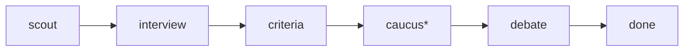

```text
    ▄▄▄                            ▄▄
   ██▀▀█▄                     █▄    ██
   ██ ▄█▀ ▄          ▄        ██    ██
   ██▀▀█▄ ████▄▄▀▀█▄ ███▄███▄ ████▄ ██ ▄█▀█▄
 ▄ ██  ▄█ ██   ▄█▀██ ██ ██ ██ ██ ██ ██ ██▄█▀
 ▀██████▀▄█▀  ▄▀█▄██▄██ ██ ▀█▄████▀▄██▄▀█▄▄▄
```

Multi-agent spec debate TUI. Claude and Codex debate (propose → critique →
revise) while you steer; the accepted draft lands in `spec.md`.

## How it works

Each session moves through a fixed pipeline:



1. **Scout** — a deterministic filesystem probe (no LLM) gathers repo context
   (README, CLAUDE.md, package manifest, tree) to ground the agents.
2. **Interview** — the agents interview *you* about the goal until they have
   enough to work with (`/done` to cut it short).
3. **Criteria** — the agents propose success criteria; you revise and lock them.
4. **Caucus** (optional, `--caucus`) — each agent drafts a position privately,
   never seeing the others' drafts, then one synthesis — consensus settled,
   disagreements flagged — seeds the debate. Counters anchoring on whoever
   speaks first.
5. **Debate** — propose → critique → revise rounds until mutual LGTM, the
   round cap, or your `/done`.

### Roles and the models behind them

| Role | Transport | Model |
|---|---|---|
| Claude (primary) | `claude` CLI | your `--claude-model` pick (default: CLI default) |
| Codex (primary) | `codex` CLI | your `--codex-model` pick (default: CLI default) |
| Specialists (security, perf, ux, naming, ops) | `claude` or `codex`, per persona | same model as that transport's primary — a specialist is a system prompt, not a separate model |
| Moderator (optional, `--moderator`; picks the next speaker) | `codex` | pinned to the cheap model (`gpt-5.6-luna`) — it only outputs a speaker id |
| Scout | none | deterministic, no LLM |
| Autopilot's simulated user | `codex` | pinned to the cheap model |

Without `--moderator`, turn order is a deterministic rotation. Moderator,
specialists, and caucus are all also toggleable on the setup screen and
sticky across sessions (`~/.bramble/setup.json`).

## Prerequisites

- **`bun`** — install via [bun.com](https://bun.com). Bramble runs on the
  Bun runtime (not Node).
- **`claude`** — install via [claude.ai/code](https://claude.ai/code), then
  `claude /login`. Requires an Anthropic account.
- **`codex`** — install via [openai.com/codex](https://openai.com/codex),
  then `codex login`. Requires an OpenAI account.

Both agent CLIs must be on your PATH and logged in to their respective
accounts.

Bramble fails fast with an install hint if either binary is missing. To try
the TUI without either CLI, pass `--mock` for scripted fake agents.

## Quickstart

```sh
bun install
bun link                                      # puts `bramble` on your PATH
bramble "design an auth system"               # real claude + codex (default)
bramble --mock "design an auth system"        # scripted fakes, no CLIs needed
```

Without linking, substitute `bun run dev --` for `bramble`. Run without a
goal to type it into the prompt-entry screen:

```sh
bramble
```

## Flags

```
bramble [flags] <goal...>            start a new debate
bramble --resume <name>              resume a prior session
bramble --list                       list sessions in ./.bramble

Debate:
--rounds N                           max round cap (default 8)
--auto / --collab                    back-to-back turns vs. pause-between
--caucus / --no-caucus               private independent positions + synthesis
                                     before the public debate (default off)
--moderator / --no-moderator         a cheap LLM picks the next speaker
                                     instead of deterministic rotation
                                     (default off)

Agents:
--mock                               scripted fake agents — demo/dev, no
                                     CLIs needed (real is the default)
--test                               real agents pinned to cheap/fast models
                                     (low effort on both sides)
--claude-model <id>                  e.g. claude-fable-5
--claude-effort <low|medium|high|xhigh|max>
--codex-model <id>                   e.g. gpt-5.6-sol
--codex-effort <low|medium|high>
--codex-transport <app-server|exec>  one persistent codex process (default)
                                     vs. legacy per-turn codex exec
--isolated                           spawn agents in a tmpdir so repo
                                     CLAUDE.md / AGENTS.md don't leak in
--specialist <id>                    add specialist critics (security, perf,
                                     ux, naming, ops); repeatable or
                                     comma-separated
--turn-timeout <seconds>             kill a silent agent turn (default 300)

Output:
--format <md|xml|json|html>          spec output format (default md)

Autopilot (headless — no TUI):
--autopilot                          run to completion with a cheap LLM
                                     answering the interview; prints the
                                     spec and exits. Pairs with --test.
--autopilot-answers <n>              interview questions to answer before
                                     forcing the debate (default 3)

Session:
--name <name> / --dir <path>         session name override / storage root
```

In real mode, after entering a goal you'll see a model picker (↑↓/Tab to
move rows, ←→ to cycle options, `e` on "custom…" to pin any id). Selections
override any CLI-flag defaults.

## Runtime artifacts

Sessions write to `./.bramble/<session-name>/`:

- `spec.md` — accepted spec body.
- `checkpoint.md` — curated end-of-session summary: outcome, decision
  journey, per-voice highlights, deferred/open items. The doc to paste
  into a PR or hand to an implementing agent.
- `draft.md` — current in-flight draft (cleared on accept).
- `debate.md` — every turn rendered as markdown.
- `transcript.jsonl` — append-only structured log (source of truth for
  `--resume`).
- `export.md` — written on `/export` (goal + spec + debate transcript).

## In-app keys

- `i` / `Esc` — insert / scroll mode.
- `Tab` — swap focus between chat and spec panes.
- `j`/`k`, `gg`/`G`, `Ctrl-u`/`d` — vim-style scroll.
- `Ctrl-o` — reveal full proposals / draft side-by-side.
- `/export [name]` — write export.md (bare = session dir, named = cwd).
- `/copy` — copy accepted spec to system clipboard.
- `/quit` or `Ctrl-D` — exit.

## Developing

Working on bramble itself — stack, repo layout, dev loops, tests, CI,
architecture notes — is covered in [DEVELOPMENT.md](DEVELOPMENT.md).

## License

MIT — see [LICENSE](LICENSE).
